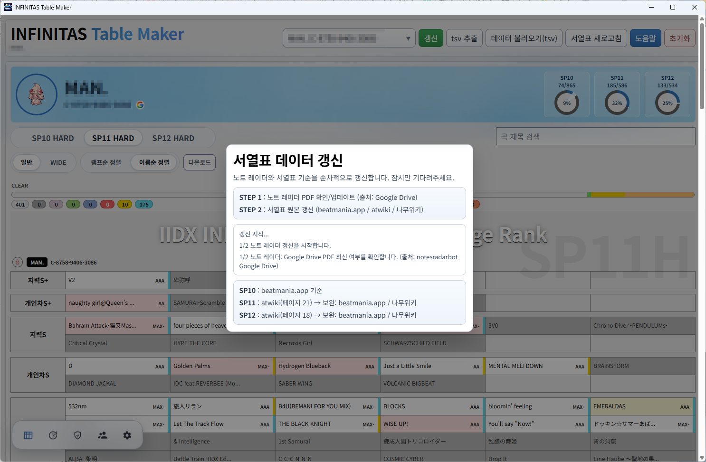

# INFINITAS Table Maker

**Reflux**(https://github.com/olji/Reflux) 를 통해 추출한 INFINITAS 플레이 데이터를 기반으로 SP10/11/12 HARD 서열표, 히스토리, 목표 기능들 수행하는 프로그램입니다.

## 주요 기능
- **서열표**: SP10/11/12 HARD Table, 일반/WIDE, 서열표 다운로드, 노트 레이더 정보 확인 등
- **히스토리**: 램프/점수/목표/레이더 변경 이력 확인
- **목표**: CLEAR/SCORE/RANK 목표 추가/갱신, 가져오기/내보내기 등
- **소셜**: Google 연동된 계정만 사용 가능. 팔로우/팔로워, 피드, 팔로우 레이더/비교, 목표 전송 기능 등

## 사용 방법

### 1. 계정 생성

- 처음 프로그램을 실행하면 계정 생성 단계부터 시작합니다.
- DJ NAME(중복 가능), INFINITAS ID를 작성한 후 저장을 눌러 계정을 생성합니다.
- INFINITAS ID를 빈칸으로 생성하면 C-0000-0000-0000으로 생성되며 이후 Google 연동을 진행할 수 없습니다.

### 2. 최초 정보 갱신

- 생성이 완료된 후의 화면입니다.
- 최초 데이터를 갱신하기 위해 갱신 버튼을 클릭합니다.
- 잠시 후 **INFINITAS 갱신** 팝업 창이 표시되고 CMD 형태의 **Reflux** 창이 실행됩니다.
- 이 상태에서 INFINITAS를 실행하고 로그인까지 진행한 후 종료합니다.

- INFINITAS 갱신 팝업 창에서 **갱신 완료** 버튼이 표시되면 데이터가 정상적으로 등록된 것입니다.

- **갱신 완료** 버튼을 클릭한 후 우측 상단의 **서열표 새로고침** 버튼을 클릭하여 서열표 최신 정보를 불러옵니다.
- 초기 세팅이 완료되었습니다.

## 기능 설명

### 서열표

- Reflux를 통한 tsv 데이터를 기반으로 서열표를 정리합니다.
- 서열표 데이터는 **https://beatmania.app/, https://w.atwiki.jp/bemani2sp11** 등의 데이터를 참조하여 작성되며, **서열표 새로고침** 버튼을 통해 주기적인 업데이트가 필요합니다.
- 본인 계정에서 해금되지 않은 곡은 그레이 표시됩니다.
- **다운로드** 버튼으로 서열표를 이미지로 다운로드할 수 있습니다.

#### 노트 레이더

- 계정 아이콘을 클릭하고 **레이더** 항목을 선택하여 자신의 INFINITAS 계정 데이터의 노트 레이더 정보를 확인할 수 있습니다.
- 그래프를 클릭하면 각 요소의 점수 대상곡을 리스트로 확인할 수 있습니다.

- 서열표 상에서 악곡을 클릭하면 해당 악곡의 노트 레이더 정보 및 플레이 데이터를 확인할 수 있습니다.

#### 전곡 순회 진행도

- 계정 정보 우측에 각 레벨의 순회 정보를 확인할 수 있습니다.
- 전곡 플레이, 전곡 하드 클리어, 전곡 익스하드 클리어, 전곡 풀콤보 달성 시 훈장이 표시됩니다.

### 히스토리

- 정보가 갱신될 때마다 지금까지의 히스토리가 저장되며, 히스토리 탭에서 이를 확인할 수 있습니다.

### 목표

- 목표의 종류, 레벨, 악곡, 난이도, 목표를 선택하여 추가할 수 있습니다.

- 추가한 목표는 갱신 UI에 표시되며, 목표 달성 시 실시간으로 클리어 상태가 표시됩니다.
- 단, 정상적으로 갱신이 완료되어 tsv 데이터가 업데이트되어야 최종적으로 적용됩니다.

- 목표 UI에서도 달성된 상태를 확인할 수 있습니다.

### 소셜

- Google 연동이 완료된 계정에서만 표시됩니다.

- 소셜 UI입니다. 아직 개발 단계이며, 팔로우의 노트 레이더 확인 및 팔로우와의 간단한 데이터 비교 정도의 기능만 구현되어 있습니다.

## 주의 사항
- Reflux 연동 특성상 실행 시 관리자 권한이 필요합니다.
- AI의 도움을 받아 개발되었으며, 초기 버전이므로 버그 혹은 개선사항으로 인한 패치가 잦을 수 있습니다. 

## 기술 스택
- Electron
- Vanilla JS + HTML + CSS
- Supabase (Auth/Postgres RPC)
- Google OAuth